# BIOE245 Homework: PathMNIST Image Classification Report


**Author:** Parimal Joshi 


## Task 1: Run Training

\[x] Training run completed successfully.


## Task 2: Training Configuration Analysis


**1. What learning rates are used in the training?**

> Learning rate used = 0.001 (from train\_and\_eval.py) 
> There is a learning rate scheduler. The learning rate droppes to 0.0001 after 50 Epochs. After Epoch 75, learning rate is dropped to 0.00001. 


**2. What is the train/val/test split of the dataset?**

> There are 107177 samples in total and they are split into:
> * Train: ~84% (89,995 / 107,177)
> * Validation: ~9.3% (10,003 / 107,177)
> * Test: ~6.7% (7,179 / 107,177)


**3. What are the dimensions of the model input per batch?**

> Model is using default 28x28 input image size with 3 channels for rgb. Hence, dimensions of model input per batch are (3, 28, 28). There is no resize flag, hence images are kept at 28x28. 


**4. What is the dimension of the model output during training? What does it represent?**

> Output dimension of the model is 9x1 vector for each sample. Since the PathMNIST dataset has 9 tissue types, there are 9 classes. 


**5. What type of task is this? What loss function is used?**

> The model is using `CrossEntropyLoss()` for multi-class classification problem.


**6. How many files are generated after training? Where are they located and what do they contain?**

> The files are generated at 'OUTPUT\_ROOT' specified in the `train_and_eval.sh`. 
>
> 1. PyTorch Model File (.pth): This file has information about all the weights and biases after the model is trained. 
> 2. Model statistics log file: This file has information about Training, Validation, and Testing accuracies and AOC values. 
> 3. CSV files: There are 3 CSV files generated, each for training, validation, and testing; where each row represents a sample and columns represent the prediction probability. This file is generated by Testing script.  
> 4. Tensorboard\_Results Folder


## Task 3: Training Statistics Visualization


**1. Where are the training statistics stored? Demonstrate how to visualize them.**

> Training statistics are stored in a separate Tensorboard\_Results Folder. We can view the tensorboard log file with a command 

```bash

tensorboard --logdir <path/to/log/directory>

```


**2. How many curves are displayed? What do they represent?**

> We generate 10 curves in total. Test(AUC, Acc, Loss), Val(AUC, Acc, Loss), Train(AUC, Acc, Loss, Log loss)
>
> They represent AUC, Accuracy, and Loss values over the number of epochs for training , testing, and validation datasets. Thye are generated by 'test()' function.


**3. How does the learning rate schedule correlate with the behavior of the curves?**

> There are 100 epochs, and the scheduler drops the learning rate by 90% after each milestone. There are 2 milestones defined \[0.5 \* num\_epochs, 0.75 \* num\_epochs]
>
> Before Epoch 50, the learning rate is high, causing the model to take longer "steps". This causes the massive spikes and jagged lines.
>
> After Epoch 50, the curves smooth out (You can definitely see that in the Training and Validation curves). The learning rate dropped to 0.0001, so the model is now taking fine-tuned steps. You can see another minor stabilization at Epoch 75 where learning rate is dropped to 0.00001.


**4. What observations can you make about the curve trends?**

> While the training accuracy hits 1.0, the Test accuracy is around ~0.90 to 0.91 (90-91%), meaning the model could be slightly overfitting. 

> However, we should also look at Test AUC, which sits around an excellent 0.98.


**Training Curves Screenshot:**
#### Testing curves:

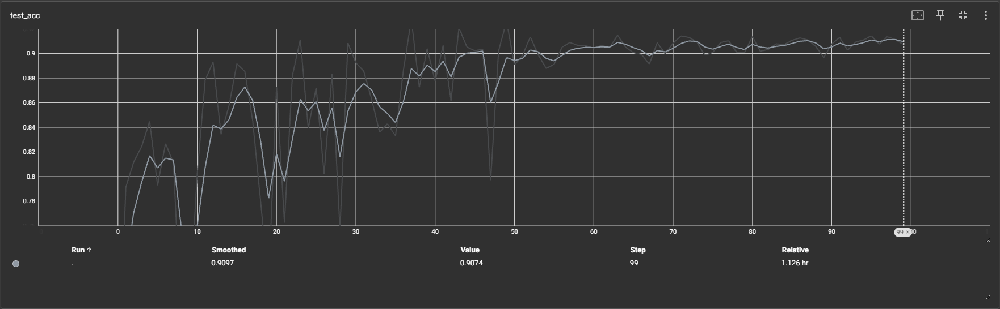

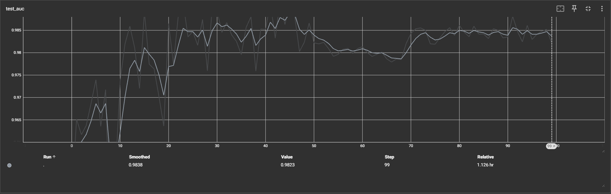

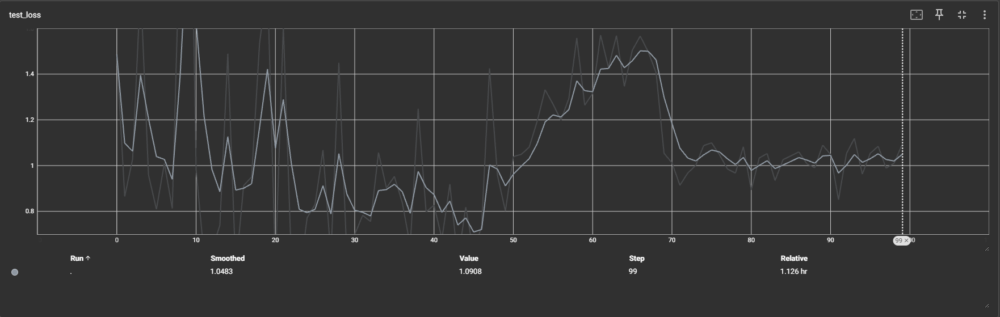

#### Training curves:

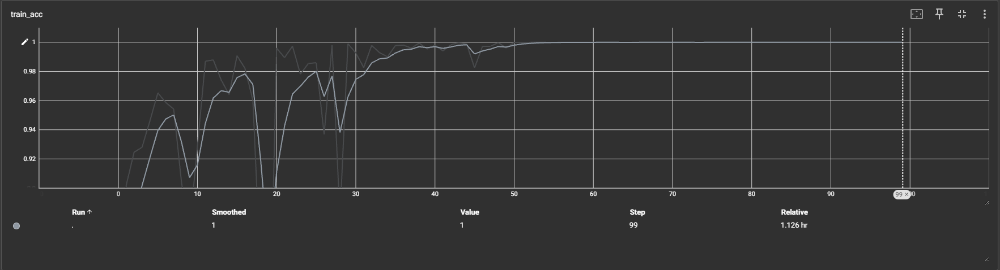

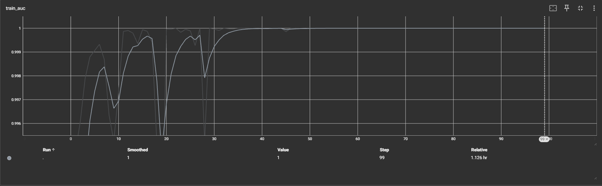

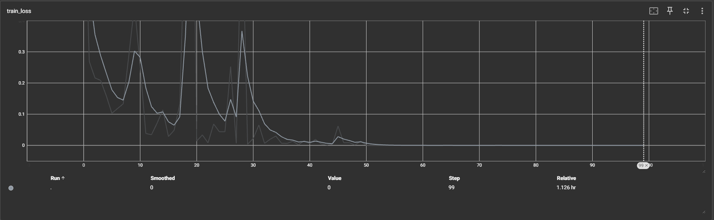

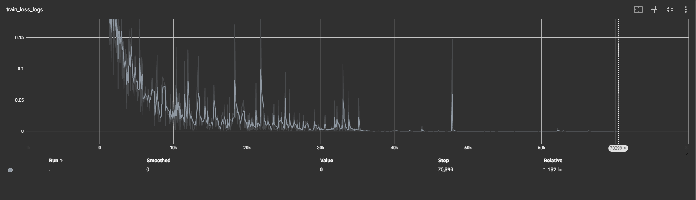

#### Validation curves:

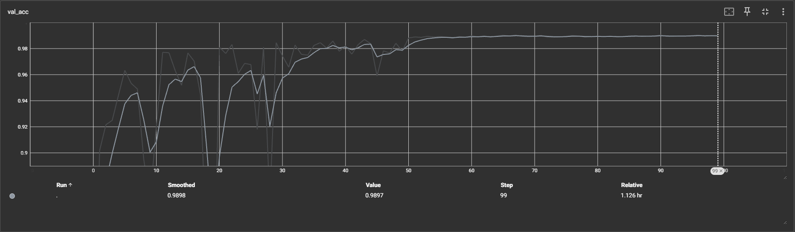

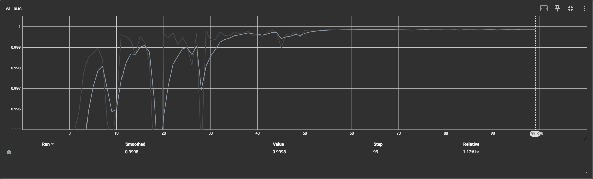

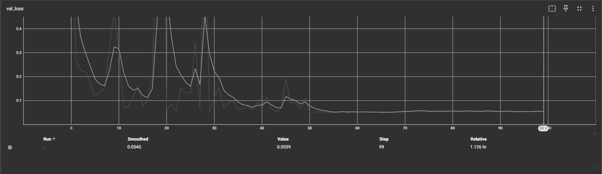


## Task 4: AUC Metric Analysis

According to this \[Google ML Glossary post](https://developers.google.com/machine-learning/glossary#AUC), AUC (Area Under Curve) is a metric between 0.0 and 1.0 that represents a **binary** classification model's ability to separate positive classes from negative classes.


**1. Is AUC used in this training script? If so, is it applied directly for binary classification, or are there adaptations for multi-class classification?**

> At the end of each epoch the model checks's AUC scores with Validation set:

```bash

cur\_auc = val\_metrics\[1]

if cur\_auc > best\_auc:

&nbsp;   best\_epoch = epoch

&nbsp;   best\_auc = cur\_auc

&nbsp;   best\_model = deepcopy(model)

```

> It's used to select the best model parameters.
>
> It is applied to use for multi-class classification as we are solving 9 class classification problem. 


**2. What curve does "AUC" refer to? Plot this curve.**

> "AUC" stands for Area Under the Curve. The specific curve refers to the ROC AUC Curve (Receiver Operating Characteristic Curve).
The ROC curve plots the True Positive Rate (Sensitivity) on the Y-axis against the False Positive Rate (1 - Specificity) on the X-axis for various classes in the classification model.
> Its majorly a binary classification tool but to use it for multiclass classification problem you need a One-vs-Rest model. The below curves are One-vs-Rest curves which are specific for each class where, each class is treated as positive, and all others as negative for a single class curve. While doing this we convert a multiclass problem to a bianry problem for indidual classes. 
> In the end we can average all the class ROC AUC to get a final test AUC number that is 0.98 in our case. 

**ROC Curve Plot:**

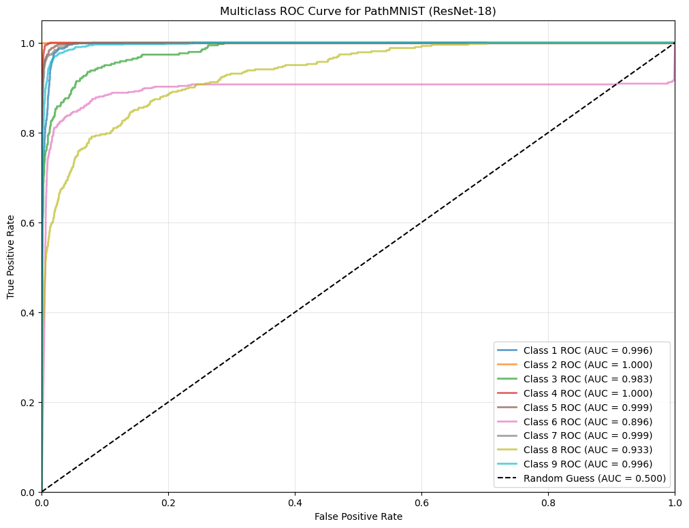


**3. Test Set Examples**

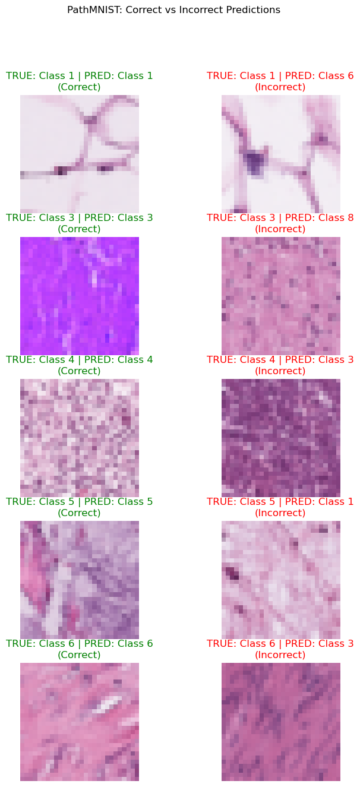

